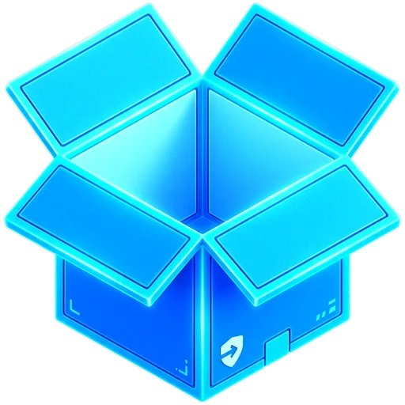
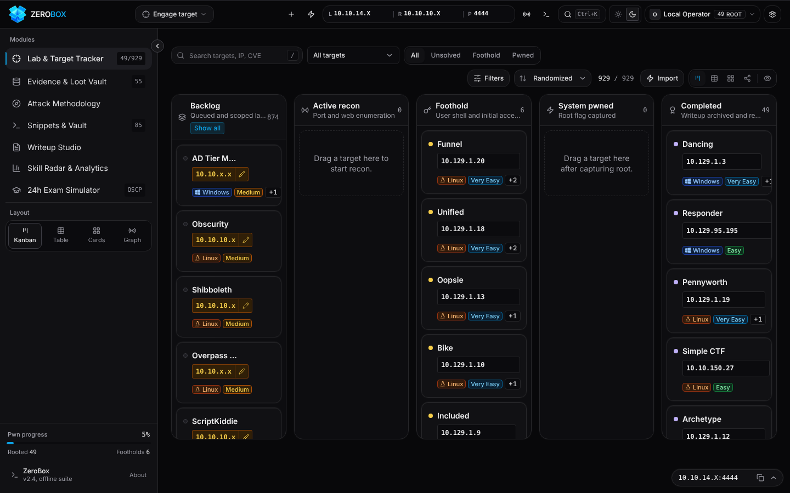

<div align="center">



# ⚡ ZeroBox — The CTF Tracker Built for Hackers

### Track every HTB & TryHackMe box, from recon to root, in one free, offline, keyboard-driven dashboard.

**No signup. No backend. No tracking. Just open it and start hacking.**

<br />

[](https://ctftracker.com/)

[](https://github.com/0xdnd/ctf-tracker/stargazers)
[](https://ctftracker.com/)
[](https://ctftracker.com/)
[](https://ctftracker.com/)
[-10B981?style=flat-square&logo=github)](https://0xdnd.github.io/)
[](https://www.linkedin.com/in/daniel-dayan-a66322352/)
[](https://buymeacoffee.com/0xdnd)
[-F59E0B?style=flat-square&logo=shield)](LICENSE)

<a href="https://ctftracker.com/"></a>

**[🚀 Try it live](https://ctftracker.com/)** · **[✨ Features](#-core-modules)** · **[🛠️ Run locally](#️-local-development--build)** · **[📝 Writeups](https://0xdnd.gitbook.io/thm-writeups/)**

</div>

---

## 🤔 Why ZeroBox?

Grinding for **OSCP, CPTS or CRTO**? Your progress is probably scattered across browser tabs, a Notion page, a text file of creds and a cheatsheet you keep re-typing IPs into. ZeroBox puts it all in one place:

| Instead of… | ZeroBox gives you… |
|:---|:---|
| 📋 A messy spreadsheet of boxes | **929 HTB & THM machines** pre-loaded, on a Kanban board from *Backlog* to *Pwned* |
| 🔁 Editing `10.10.x.x` in every command | A **dynamic cheatsheet** — set `LHOST`/`LPORT`/`TARGET_IP` once, every command updates |
| 🐚 Googling "python reverse shell" again | **130+ reverse shells** with matching listeners, one click to copy |
| 🔑 Creds lost in random notes | A **loot vault** for every hash, key, flag and password you find |
| 😰 Wondering if you're exam-ready | A **24h exam simulator** with OSCP/CPTS/CRTO-style scoring |

> 🔒 **100% private:** everything lives in your browser (LocalStorage + IndexedDB). Nothing is ever sent anywhere.

> ⭐ **If ZeroBox saves you time, please [star the repo](https://github.com/0xdnd/ctf-tracker/stargazers)** — it's the best way to help more hackers find it!

---

## 🚀 Core Modules

### 1. 🛡️ Lab & Machine Tracker
- **929-machine catalog:** 415 retired HTB machines and Starting Point labs, 514 THM CTF rooms, plus your own custom targets.
- **5-stage attack lifecycle:** `Target Backlog` → `Active Recon` → `Foothold Obtained` → `System Pwned` → `Completed & Logged`.
- **Four views:** Kanban board, dense sortable table, card grid, and an attack **graph view** with an edge inspector for pivots between hosts.
- **Target dossier:** per-machine detail page with Nmap/scan import, methodology checklist, flags, and user/root timers.
- **Fast search:** `/` or `Ctrl+K` / `Cmd+K`, plus a global command palette.

### 2. 🗝️ Evidence & Loot Vault
- Credentials, hashes, flags, keys and tokens collected across every target in one place.
- Loot timeline, quick add, and an export drawer for reports.

### 3. 🧭 Methodology & Field Manual
- **Attack methodology:** phase-by-phase tree with decision branches and playbooks.
- **Dynamic cheatsheet:** set `LHOST`, `LPORT`, `TARGET_IP` once and they are injected into every command.
- **Reverse shell builder:** 130+ Linux and Windows payloads with matching listener commands.
- **Notes workspace:** Obsidian-style note viewer with multi-tab docked notes and an IndexedDB-backed private vault.

### 4. 📝 Writeup Studio & Reports
- Dual-pane Markdown editor with live preview.
- Pentest report templates pre-filled with target data, exportable as `.md` for Obsidian or GitBook.

### 5. 📊 Analytics & ⏱️ Exam Simulator
- **Skill radar** across Web, AD, Linux/Windows PrivEsc, Pivoting and more, plus a **90-day activity heatmap** and speed benchmarks.
- **24h exam simulator** with OSCP, CPTS and CRTO-style rulesets, scoring, breaks, evidence proofs, and a burn-down chart.

---

## 🎨 Design & Principles
- **Refined tactical UI:** calm dark (zinc / graphite / OLED) and light themes, switchable presets, Inter for text and monospace for IPs, hashes and commands.
- **Accessible:** WCAG 2.1 AA contrast, visible focus states, keyboard navigation, and `prefers-reduced-motion` support.
- **Offline-first & private:** zero backend and no outbound network requests. All data stays in your browser (LocalStorage + IndexedDB).
- **Data portability:** one-click JSON backup and restore.
- **Audio cues:** synthesized alerts with no external audio files.

---

## 🛠️ Local Development & Build

### Prerequisites
- Node.js 18+ (tested on Node.js 24)
- npm 9+

```bash
# Clone the repository
git clone https://github.com/0xdnd/ctf-tracker.git
cd ctf-tracker

# Install dependencies
npm install

# Start local development server
npm run dev

# Build production bundle
npm run build

# Preview production build locally
npm run preview
```

> **Windows shortcut:** after `npm install`, double-click `START-TRACKER.bat` to start the dev server and open the tracker in your browser. On macOS/Linux, use the npm commands above.

### 🖥️ Desktop App (Tauri)
ZeroBox also ships as a native desktop app. With the [Tauri prerequisites](https://tauri.app/start/prerequisites/) installed:

```bash
npm run tauri:dev     # run the desktop app in development
npm run tauri:build   # build an installer
```

### ✅ Testing
```bash
npx tsc --noEmit   # type check
npm test           # unit & component tests (Vitest)
npm run test:e2e   # browser E2E crawl (Python + Playwright)
```

---

## 👨‍💻 Creator & System Architect

**ZeroBox** is designed, engineered, and maintained by **Daniel Dayan** ([@0xdnd](https://github.com/0xdnd)) — Cybersecurity Researcher, Penetration Tester, and Offensive Security Architect.

<div align="center">

| Channel | Identifier | Link |
|:---|:---|:---|
| 🌐 **Official Portfolio** | `Daniel Dayan Security & Research` | [**0xdnd.github.io**](https://0xdnd.github.io/) |
| 💼 **LinkedIn Profile** | `daniel-dayan-a66322352` | [**Connect on LinkedIn**](https://www.linkedin.com/in/daniel-dayan-a66322352/) |
| 💻 **GitHub Repositories** | `@0xdnd` | [**Follow on GitHub**](https://github.com/0xdnd) |
| 📝 **CTF Write-ups & Docs** | `THM & HTB Research Vault` | [**Read GitBook Writeups**](https://0xdnd.gitbook.io/thm-writeups/) |
| ☕ **Buy Me a Coffee** | `0xdnd` | [**Support on Buy Me a Coffee**](https://buymeacoffee.com/0xdnd) |

</div>

---

## 📜 Terms of Service (ToS) & Acceptable Use Policy (AUP) Compliance

ZeroBox is engineered to strictly uphold the Terms of Service, Acceptable Use Policies, and Community Guidelines of **Hack The Box (HTB)** and **TryHackMe (THM)**:

### 1. 🛡️ Hack The Box Acceptable Use Policy (§8.2 & §8.3)
- **Zero Active Content Disclosure:** In strict accordance with HTB AUP §8.2 (*"Sharing solutions, write-ups, flags, or hints for active content is strictly prohibited"*), ZeroBox strictly excludes writeups, spoilers, and solutions for all active seasonal machines.
- **Retired Content Only:** The 415 cataloged HTB targets consist exclusively of officially retired machines and Starting Point educational labs. HTB AUP §8.3 explicitly permits community walkthroughs, educational write-ups, and streaming for content that has been retired.
- **Exclusion of Enterprise ProLabs & Fortresses:** Proprietary subscription networks and enterprise ProLabs (e.g. Dante, Offshore, RastaLabs, Cybernetics, Zephyr) are excluded from the catalog.
- **Anti-Scraping / No-Crawling:** ZeroBox contains zero scrapers, bots, or automated crawlers targeting HTB servers (HTB UA §6.1).

### 2. 🎯 TryHackMe Terms of Use (§3 & §5)
- **Practice Challenge Rooms Only:** 514 public community challenge rooms are indexed for individual tracking (multiplayer/KoTH competition rooms excluded).
- **Zero Raw Flag Dumping:** Solved milestones in Daniel Dayan's verified roster utilize synthetic educational tokens (e.g., `THM{flag_captured_daniel_dayan}`) rather than raw live challenge flags.
- **Zero Data Harvesting:** No automated data extraction or scraping tools are used against THM infrastructure.

### 3. 🔒 Zero-Leakage Private Notes & Vault Architecture
- **Proprietary Course Materials Excluded:** Course material, official academy modules (such as CPTS / HTB Academy), and private exam notes are **never** committed into the git repository or bundled into public build artifacts.
- **100% In-Browser IndexedDB Sandbox:** All imported field notes and obsidian vaults operate in-memory and inside the user's private client-side IndexedDB database (`zerobox_vault_db`).

### 4. ⚖️ Independent Project & Trademark Disclaimer
ZeroBox is an independent open-source tracking and educational dashboard created by Daniel Dayan. ZeroBox is **not affiliated with, endorsed by, sponsored by, or associated with Hack The Box Ltd or TryHackMe Ltd**. "Hack The Box", "HTB", "TryHackMe", and "THM" are trademarks or registered trademarks of their respective owners. All target metadata, room links, and writeup hyperlinks are referenced solely for non-commercial educational tracking and study under fair use.

---

## ⚖️ License & Intellectual Property Protection

ZeroBox is released under the **ZeroBox Source-Available Non-Commercial & Educational License (ZNSL 1.0)**.  
Copyright © 2026 **Daniel Dayan** (`@0xdnd`). All Rights Reserved.

### Summary of Terms:

| Permission / Restriction | Status | Details |
|:---|:---:|:---|
| **Personal & Educational Use** | ✅ **ALLOWED** | You may inspect, clone, build, and use ZeroBox locally for individual study, practice labs, and CTF preparation. |
| **Commercial Exploitation** | ❌ **FORBIDDEN** | You may **NOT** sell, rent, monetize, sub-license, or charge fees for this platform or any portion thereof. |
| **Public Re-Publishing / SaaS** | ❌ **FORBIDDEN** | You may **NOT** host a public web instance, re-publish, or distribute modified copies under your name without written consent. |
| **Course Bundling / Paid Training** | ❌ **FORBIDDEN** | You may **NOT** include ZeroBox in any paid course, bootcamp, or commercial subscription service. |
| **Attribution Requirement** | ⚠️ **MANDATORY** | All permitted educational mentions or references must prominently cite **Daniel Dayan** ([0xdnd.github.io](https://0xdnd.github.io/)). |

For the full legal text, see the official [**LICENSE**](LICENSE) file.


